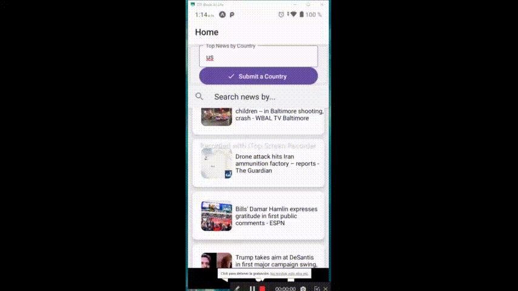

# Workshop - React Native - The News App

 <div align="center">
 
 </div>
 
 🎭 Idioma/language
 
 [Español](#Descripción)


## Overview

In this workshop we are going to create a mobile application using React Native, for this we will use Expo to generate the initial boilerplate and modify what is necessary to develop the application that will be described below.

The idea is to create a News application that includes at least the following functionalities:

  - Being able to show a list of the main News (Including Title and photo)
  - Being able to show the list by different countries from a list.
  - From an input that the user enters and returns only the news that contain said word or begin with it.
  - Being able to go to the detail of the character where you should be able to select two subscreens:
     * See the description of the info provided by the api (the free version provides only a couple of lines), author of the info, date published
     * See a link where you can access the resources of the original information. 

## screens configuration

we would need the following screens:

  * __Home__: will contain the search bar and the News list
  * __Detail__: when the user selects a News, they must enter this screen with some lower tabs to switch between `Information` and `Links`. Initially the first one will be displayed.
  * __Information__: will contain the detailed information of the news
  * __Link__: will contain a link that will redirect us to the origin of the information.

### [Let's start](#Starting)

## Descripción

En este workshop vamos a crear una aplicación mobile utilizando React Native, para ello usaremos Expo para generar el boilerplate inicial y sobre el modificar lo necesario para elaborar la aplicación que se describirá a continuación.

La idea es crear una aplicación sobre Noticias en la cual se incluyan por lo menos las siguientes funcionalidades:

 - Poder mostrar un listado de las principales Noticias (Incluyendo Titulo y foto)
 - Poder mostrar ellistado por distintos paises a partir de una lista.
 - a partir de un input que ingrese el usuario y devuelva solo las noticias que contengan dicha palabra o comienzen con ella.
 - Poder ir al detalle del personaje donde se deben poder seleccionar dos subpantallas:
    * Ver la descripción de la info otorgada por la api (la verdion free otorga solo un par de lineas),autor de la info , feche publicada
    * Ver un link a donde poder acceder a los recursos de la informacion original.

## Configuración de Screens

 nececsitaríamos las siguientes pantallas:

 * __Home__: contendrá la barra de búsqueda y el listado de Noticias
 * __Detail__: cuando el usuario seleccione una Noticia se deberá ingresar a esta pantalla con unos tabs inferiores para ir a switcheando entre `Information` y `Links`. Inicialmente se mostrará la primera.
 * __Information__: contendrá la información detallada de la noticia
 * __Link__: contendrá un link que nos redirigira al origen de la informacion.

 <!-- Get Started / Install: -->

## Starting


Prerequisites: To run the react-native project on your mobile or emulator you need some
more specific settings, I recommend this link
(https://facebook.github.io/react-native/docs/getting-started) if you do not already have the recommended settings on your machine.

1. Install
   [Git](http://git-scm.com/downloads) e
   [NodeJS](http://nodejs.org/download/),
   in case you don't have them yet.

2. Clone repository:

   ```sh
   $ git clone https://github.com/Hans-Rafael/React-Native-NewsApp.git
   ```

3. Go to project folder:

   ```sh
   $ cd News
   ```

4. Install all dependences:

   ```sh
   $ npm install ou yarn
   ```

5. Finally run:

   ```sh
   $ react-native run-android (Android)
   or
   $ react-native run-ios (IOS)
   ```
   or
    or
   $ npm start
   ```

   Now you will see the app running on your mobile phone or emulator :D
